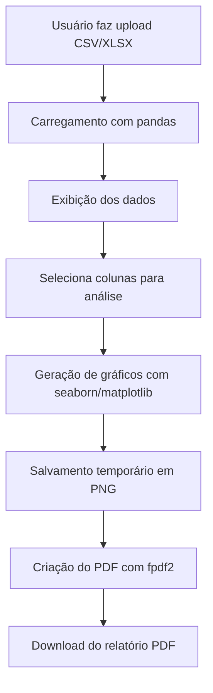

# 📊 Report Lab – Gerador de Relatórios de Dados

O **Report Lab** é uma aplicação web desenvolvida com [Streamlit](https://streamlit.io/) que permite a qualquer usuário carregar arquivos CSV ou Excel, realizar análises exploratórias, visualizar gráficos estatísticos e exportar relatórios analíticos em PDF com visual profissional.
[🔗 Acesse o aplicativo online aqui](https://reportlab-app-app-ntfmvaf82h4lymoyqnx4bu.streamlit.app/#report-lab)
---

## Funcionalidades Principais

-  **Upload de Dados** (CSV/XLSX)
-  **Análise Numérica** com histogramas, boxplots e estatísticas descritivas
-  **Análise Categórica** com gráficos de barras horizontais
-  **Análise Temporal** com séries temporais agregadas por período
-  **Geração de PDF Profissional** com logo personalizada e gráficos integrados

---

## Arquitetura e Tecnologias

| Componente       | Versão Mínima | Finalidade                    |
|------------------|----------------|-------------------------------|
| Python           | ≥ 3.7          | Linguagem principal           |
| Streamlit        | ≥ 1.22.0       | Interface web                 |
| pandas           | ≥ 1.5.0        | Manipulação de dados          |
| numpy            | ≥ 1.24.0       | Operações numéricas           |
| matplotlib       | ≥ 3.7.0        | Geração de gráficos           |
| seaborn          | ≥ 0.12.0       | Estilização estatística       |
| fpdf2            | ≥ 1.7.2        | Criação de relatórios em PDF  |
| openpyxl / xlrd  | ≥ 3.0.0 / 2.0.0| Leitura de planilhas Excel    |
| Pillow           | ≥ 9.0.0        | Manipulação de imagens        |

---

## Instalação

### 1. Clone o repositório

```bash
git clone https://github.com/seu-usuario/report-lab.git
cd report-lab
```

### 2. Crie e ative o ambiente virtual

```bash
python -m venv venv
source venv/bin/activate  # Linux/Mac
venv\Scripts\activate     # Windows
```

### 3. Instale as dependências

```bash
pip install -r requirements.txt
```

### 4. Execute a aplicação

```bash
streamlit run app.py
```

---

## Fluxo de Dados



---

## Principais Componentes do Código

### Funções Principais

- `load_data()`: Carrega arquivos CSV ou Excel e aplica cache com `@st.cache_data`.
- `create_pdf_report()`: Gera o relatório completo em PDF com tabelas e imagens.
- `save_plot()`: Salva visualizações como imagens temporárias para o PDF.

### Interface de Usuário

- **Página inicial**: Apresentação amigável do app com passo a passo.
- **Sidebar**: Upload de arquivos e logo, configurações de análise.
- **Layout Responsivo**: Uso de `st.columns()` para distribuição dos elementos.

---

## Otimizações e Boas Práticas

- Cache inteligente com `@st.cache_data`
- Limpeza automática de arquivos temporários
- Processamento local: não há envio de dados para servidores
- Segurança de threads com `matplotlib.use("Agg")`

---

## Limitações Atuais

- Limite de categorias visíveis nos gráficos categóricos (Top 20)
- Performance limitada a arquivos de pequeno/médio porte
- Limitado a análises numéricas e categóricas

---

## Melhorias Futuras

- Integração com bancos de dados SQL
- Exportação em múltiplos formatos (HTML, PPTX)
- Templates customizados para o relatório
- Detecção automática de outliers
- Autenticação de usuários

---

## 🔒 Segurança

- Validação de tipos de arquivo no upload
- Remoção automática de arquivos após geração do PDF
- Nenhum dado é transmitido para terceiros

---

## Referências

- [📘 Documentação Streamlit](https://docs.streamlit.io/)
- [📘 Documentação Seaborn](https://seaborn.pydata.org/)
- [📘 Documentação FPDF2](https://pyfpdf.github.io/fpdf2/)

---

## 🧑‍💻 Autora

**Letícia Góes**  
Desenvolvido como projeto de aplicação prática com potencial de equivalência ao TCC (Tipo III – Desenvolvimento de Software) do curso de Ciência de Dados – UNIVESP.

---

## 📎 Licença

Este projeto está sob a licença MIT. Consulte o arquivo `LICENSE` para mais detalhes.
